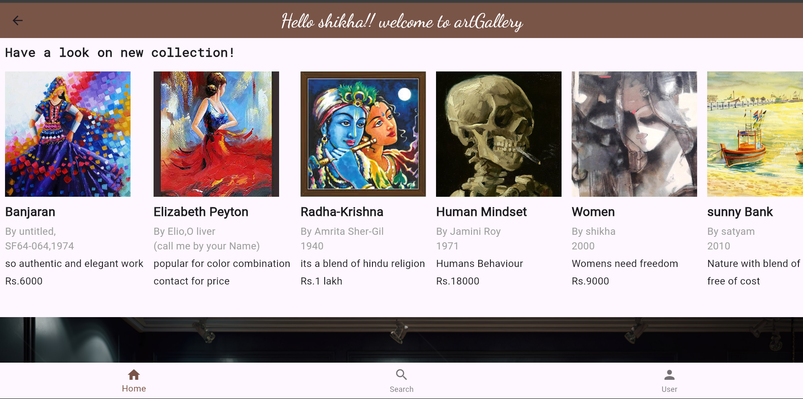
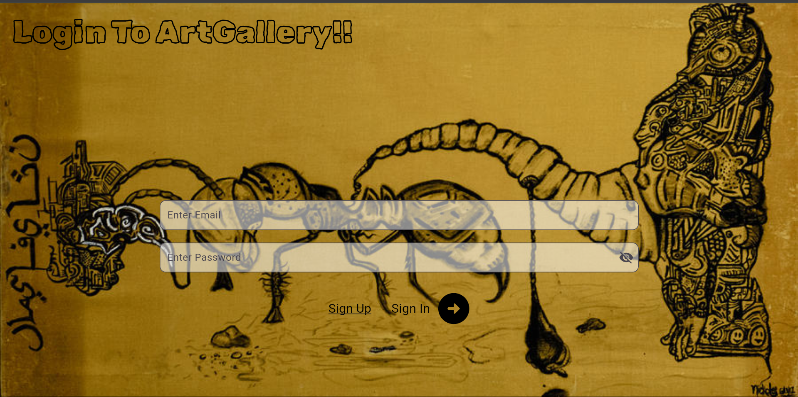
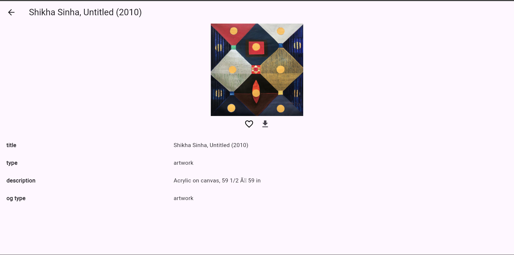
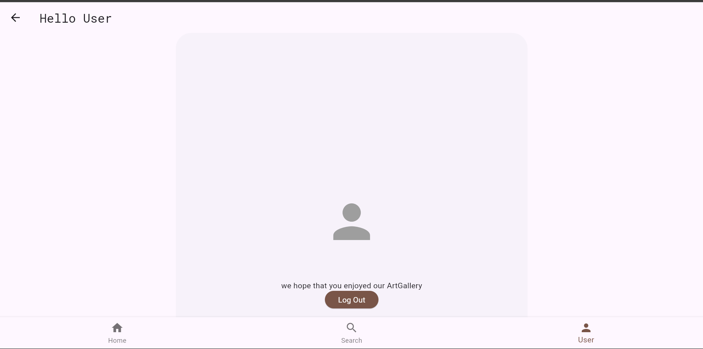

# 🎨 ArtGallery

## 🛠 Technologies Used
- **Flutter, Dart, Firebase, Cloud Storage, Artsy API**

## 📖 Description
ArtGallery is a platform that allows artists to showcase their artwork to a global audience.

### 🔹 Features:
- 🖼️ **Categorized Exploration:** Discover artworks based on art style, artist name, and popularity.
- ❤️ **Engagement Features:** Like, share, and interact with artworks seamlessly.
- 🔎 **Smart Search:** Search for artworks, artists, or keywords using the Artsy API.
- 📍 **Exhibition Locator:** Integrated map to check exhibition locations directly.

## 📸 Screenshots

### 🏠 Home Page

### 🔑 Login Page

### 🔍 Search Page

### 📜 Search Results

### 🚪➡️ Log Out

## 🔑 API Requirement
To use this app, you need an **ArtSy API Key**.  
🔗 [Sign up for an API key here](https://developers.artsy.net/)

---

This version adds **headings, bullet points, emojis, and screenshots** to make your GitHub README look more professional and visually appealing. 🚀🔥

Let me know if you want any more modifications! 😃
